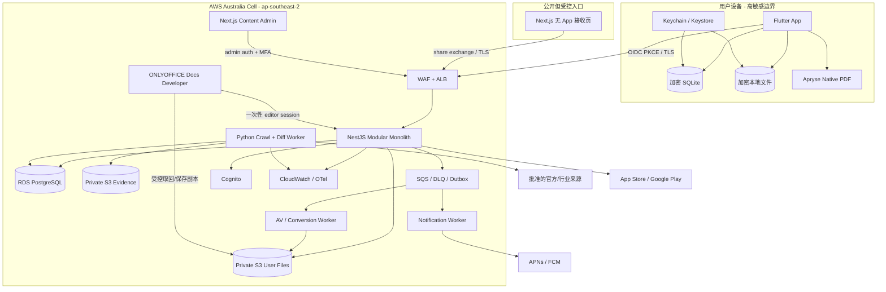
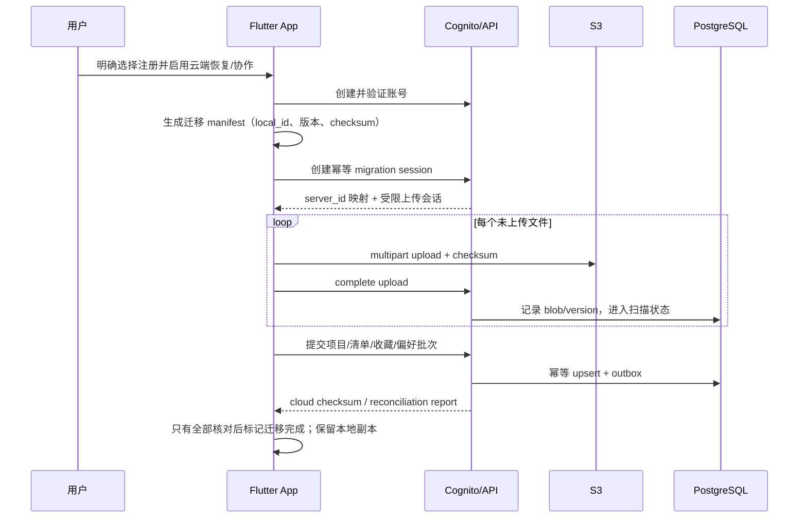
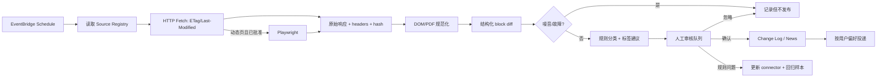

# 技术总监独立评审：第一阶段技术选型与整体架构

> 状态：**已确认，可进入 UI 与工程实施**  
> 评审角色：技术总监（独立评审）  
> 评审日期：2026-08-27  
> 依据：[`docs/product/澳洲移民申请管理App_第一阶段产品需求文档.docx`](../product/澳洲移民申请管理App_第一阶段产品需求文档.docx) v0.2  
> 地域路线：第一阶段南澳（同时覆盖相关联邦签证信息）→ 第二阶段全澳洲 → 后续热门移民国家

## 0. 最终确认

本评审确认 PRD 的五个闭环都属于第一阶段 P0，不能把其中任何一个默认为“以后再做”：移民新闻、政策 Change Log、个人材料项目、无 App 分享与 App 内协作、PDF/Word 移动处理与订阅。技术架构能够承载这些闭环，但文档编辑商业授权、首批监控来源、定价/额度和法律文本必须在上线前完成各自的硬门槛。

最终技术组合如下：

- **移动端：Flutter 3.47.1 stable + Dart 3.13.1，用 FVM 固定项目版本。** 绝不升级、切换或覆盖开发者机器上的全局 Flutter。
- **后端/API：TypeScript + NestJS 模块化单体，REST/JSON + OpenAPI，事务 Outbox + SQS 处理异步任务。** 第一阶段不拆微服务。
- **部署：AWS `ap-southeast-2`（Sydney）为澳洲数据单元，ECS + ALB/WAF。** API/web/workers 默认 Fargate；ONLYOFFICE 使用独立私网 ECS service，并按 vendor sizing/支持矩阵选择 EC2 capacity provider。开发、预发布、生产使用独立 AWS 账号。
- **数据库：Amazon RDS for PostgreSQL 17，Multi-AZ；** 用户域、内容域、计费域和审计域采用独立 schema 与数据库角色。
- **对象存储：私有 Amazon S3 + SSE-KMS；** 用户材料、公开内容证据、临时编辑文件和导出包使用不同 bucket/keyspace 与 KMS key。
- **身份：Amazon Cognito User Pool；** 第一阶段采用邮箱验证账号，管理员强制 MFA；如加入 Google 等社交登录，iOS 同时提供 Sign in with Apple。
- **访客本地优先：SQLite/Drift + SQLCipher（或经 POC 通过的等价加密实现）及应用私有文件目录；** 密钥由 iOS Keychain / Android Keystore 封装。注册后进行显式、可恢复、幂等的本地到云迁移。
- **无 App 安全分享：Next.js 接收页 + API 每次授权 + 60 秒内 S3 临时下载 URL；** 分享 secret 不进入服务器访问日志，支持到期、密码、下载权限和撤销。
- **内容运营后台：Next.js + 同一后端的 Admin API；** 内容运营身份、权限、审计和用户材料完全隔离。
- **爬虫/差异：Python 3.13 Worker；** HTTP 条件请求优先，Playwright 仅用于经过白名单批准的动态页面；原始快照和 hash 入 S3，结构化差异与审核状态入 PostgreSQL，重大/重要变化必须人工核实。
- **PDF：Apryse Flutter/Native SDK；Word：Apryse 本地只读预览 + 自托管 ONLYOFFICE Docs Developer 移动 WebView 进行账号模式下的 DOCX 高级编辑。** 两项均为商用授权和真机 POC 硬门槛。
- **订阅：iOS StoreKit / App Store Server Notifications V2 + Google Play Billing / RTDN；** 服务端计算 entitlement，客户端结果不作为最终授权依据。
- **通知：APNs/FCM 远程通知 + 系统本地通知；** 锁屏文案不包含文件名、签证判断或敏感材料细节。

本系统不会声称端到端加密。服务器需要为分享、病毒扫描、格式转换和协作在受控服务中解密文件；正确表述是“设备本地加密、传输加密、云端 KMS 加密、最小权限访问和可审计处理”。

---

## 1. 需求理解与架构判断

### 1.1 产品不是资讯 App，也不是普通清单 App

第一阶段同时存在三种完全不同的数据和风险曲线：

1. **公开内容域**：政府/行业新闻、官方页面快照、差异证据、人工核实和更正记录。
2. **高敏感个人工作区**：护照、出生证明、银行流水、健康和家庭关系资料，以及项目、提醒和协作记录。
3. **商业化文档工具域**：本地编辑、云端 DOCX 编辑会话、试用和应用商店订阅权益。

这三类数据不能共用一套“万能管理员”、公开 bucket、日志字段或保留期。架构从第一天就按领域和数据敏感度隔离，但在第一阶段仍采用模块化单体控制成本和交付风险。

### 1.2 第一阶段地域不是纯粹的 “SA-only”

南澳州担保会依赖联邦签证类别、职业清单和法律文书。因此第一阶段内容模型应当是：

- `country = AU`
- `jurisdiction = AU-SA` 或 `AU-FED`
- `visa_program`、`occupation_code`、`source_scope` 与 jurisdiction 多对多关联

UI 可默认呈现南澳，但数据模型和 API 不允许出现 `sa_news`、`sa_visa_type` 等不可扩展的硬编码列。

### 1.3 关键非功能目标

- 用户不注册也能完成本地项目、清单、提醒、导入、基础查看和导出备份。
- 云端任何文件访问都必须通过对象级授权；仅知道 URL、UUID 或文件 key 不能获得权限。
- 分享撤销后，新请求在 5 秒内失效；已下载到对方设备的文件不可远程收回，产品必须明示。
- 同一文件不做静默覆盖；每次保存生成不可变版本，并使用乐观锁暴露冲突。
- 重大和重要政策变化不允许爬虫直接发布或直接推送。
- 日志、分析、崩溃报告和通知中不得出现文件正文、原始文件名、护照号、银行资料或分享 secret。
- 第一阶段生产目标：API 月可用性 99.9%，已接受上传成功率 ≥ 99.5%，无崩溃会话 ≥ 99.5%；这些是运行目标，不替代功能验收。

---

## 2. ADR-001：移动端选择 Flutter

**状态：Accepted**

### 背景

产品需要 iOS/Android 同步交付、丰富表单和离线工作区、相机/相册/文件导入、通知、订阅、PDF 原生 SDK、WebView DOCX 编辑器和安全存储。文档能力无论采用何种跨平台框架，都会包含少量 Swift/Kotlin 桥接代码。

### 比较

| 方案 | 优势 | 本项目主要风险 | 结论 |
|---|---|---|---|
| Flutter | 单一 UI/状态代码库；离线数据层和复杂交互一致；原生 Platform View/Channel 可接文档 SDK | 商业 SDK 的 Flutter wrapper 可能缺 API，仍需 Swift/Kotlin 扩展 | **选择** |
| React Native | React/TypeScript 人才多；原生组件映射直接；New Architecture 性能和互操作改善 | 文档、数据库、加密、相机等原生模块对 RN 版本/New Architecture 的兼容矩阵更分散；JS 与原生依赖升级面更大 | 不选 |
| Swift + Kotlin 原生 | 平台能力、文件系统和商业 SDK 集成最直接 | 两套 UI、业务逻辑、离线同步和测试；第一阶段成本、节奏和一致性风险最高 | 不选，除非未来拆出独立编辑器团队 |

React Native 官方说明 0.76 起 New Architecture 默认开启，但旧库仍可能依赖互操作层或需要迁移；该方向并非不可行，只是对本项目“多种原生文档/文件能力 + 小团队双平台同步交付”的总体风险更高。Flutter 也不是“无原生代码”，文档 SDK 缺失的 wrapper API 必须通过受控的平台桥接补齐。

### 决策

选择 Flutter。UI、导航、业务规则、同步队列和 API 客户端写在 Dart；以下能力保留原生适配层：

- Apryse 文档视图与未暴露的 PDF API；
- iOS Data Protection / Keychain 与 Android Keystore 安全配置；
- 文件协调、后台上传、系统分享、相机扫描；
- StoreKit / Play Billing 的平台差异；
- ONLYOFFICE 移动 WebView 的安全会话容器。

### 后果

- 共享业务代码并不代表 UI 必须完全相同；权限、文件选择、通知设置和订阅 UI 遵循各平台规范。
- 所有商业 SDK 升级必须同时跑 iOS/Android 真机回归，不能只验证 Flutter demo。
- 若某个文档 SDK 只在一个平台满足 P0，不能以另一平台“稍后支持”通过上线门槛。

---

## 3. ADR-002：FVM 固定 Flutter，禁止改全局版本

**状态：Accepted / Non-negotiable**

Flutter 官方 Windows release manifest 在本评审日显示 stable hash `6655482...` 对应 **Flutter 3.47.1 / Dart 3.13.1，2026-08-19 发布**。项目固定到这个精确版本：

```json
{
  "flutter": "3.47.1",
  "updateVscodeSettings": true,
  "updateGitIgnore": true,
  "runPubGetOnSdkChanges": true
}
```

工程规则：

- 提交 `.fvmrc` 和 `pubspec.lock`；忽略 `.fvm/flutter_sdk` 缓存本体。
- 本地只允许 `fvm flutter ...`、`fvm dart ...`；IDE SDK 指向项目的 `.fvm/flutter_sdk`。
- CI 先执行 `fvm install 3.47.1`，再校验 `fvm flutter --version` 精确匹配。
- **禁止**在本项目流程中执行全局 `flutter upgrade`、`flutter channel`、`fvm global`，禁止修改机器 PATH 中已有 Flutter，禁止用全局 Flutter 生成平台文件。
- 升级必须新建 ADR，给出 SDK/插件兼容矩阵、迁移说明、双平台构建和文档 POC 回归结果；不能在普通依赖更新中顺带升级。

---

## 4. ADR-003：后端采用模块化单体 + 独立 Worker

**状态：Accepted**

### 决策

第一阶段采用 NestJS 模块化单体，而不是微服务：

- `identity`：账号映射、设备、会话安全事件；密码和主身份凭据由 Cognito 管理。
- `workspace`：项目、申请人、清单、提醒、评论、成员和状态历史。
- `files`：上传会话、blob、文件版本、扫描/转换状态、下载授权。
- `sharing`：无 App share、App invite、权限与访问记录。
- `content`：新闻、标签、Change Log、来源、证据和更正。
- `billing`：产品、试用、store transaction 和 entitlement。
- `notifications`：偏好、模板、投递任务和回执状态。
- `audit`：不可变业务审计事件和安全事件。
- `admin`：内容审核和受限支持动作；不提供通用用户材料浏览器。

Python Worker 单独部署，负责抓取、HTML/PDF 解析、差异和分类建议。文件病毒扫描/转换使用另一个受限 Worker image，避免让不可信文件与公开网页抓取共享进程和网络权限。

### API 和异步边界

- 移动端、接收页和后台只调用 REST/OpenAPI；不直接访问 PostgreSQL。
- 客户端只在取得范围受限的预签名上传 URL 后直传 S3；上传完成必须由 API 校验对象 key、大小、MIME、checksum 和所有者。
- 数据变更与 Outbox event 在同一数据库事务提交，publisher 再投递 SQS，避免“数据已写但通知丢失”。
- 通知、病毒扫描、缩略图/转换、导出包、抓取和差异都异步执行；API 返回可查询的 operation 状态。
- 第一阶段不需要实时多人共同编辑；协作采用本地缓存 + 增量同步 + 乐观锁。真正实时 co-edit 不作为 P0 隐性依赖。

### 为什么不选 Firebase/Supabase 作为主后端

它们适合快速 CRUD，但本产品需要严格对象级授权、可审计外部分享、地区数据单元、内容审核流水线、商店通知、文档隔离转换和可解释删除/备份。可以使用托管基础设施，但核心权限、审计和数据生命周期应属于自己的后端，不把业务边界散落在客户端规则和多个触发器里。

---

## 5. ADR-004：AWS 澳大利亚数据单元与地域扩展

**状态：Accepted**

### 第一阶段部署

澳洲用户的账号和文件默认位于 `ap-southeast-2`（Sydney）：

- ECS Fargate：API、web、admin、常规 workers；
- 私网 ECS service：ONLYOFFICE，许可/容量确认后使用 vendor 支持的 image，默认以 EC2 capacity provider 避免把重型编辑器错误塞进常规 Fargate 规格；
- ALB + AWS WAF：API/后台/分享入口；
- RDS PostgreSQL 17 Multi-AZ：业务数据；
- S3 + KMS：用户文件、内容证据、隔离区、导出、备份；
- SQS + DLQ、EventBridge Scheduler、Step Functions：异步和抓取编排；
- Cognito：账号；
- CloudWatch/X-Ray/OpenTelemetry：日志、指标和 trace；
- Secrets Manager：数据库、store、editor license 和 source credentials。

### 扩展单元

不创建一个“所有国家共用、再靠 country_id 过滤”的全球数据库。采用 **cell-based architecture（地域数据单元）**：

```text
Global Directory（最少账号路由信息，无文件）
├─ AU Cell：SA → 全澳洲
├─ NZ Cell：未来
├─ CA Cell：未来
├─ UK Cell：未来
└─ US Cell：未来
```

每个 cell 有独立数据库、KMS keys、bucket 和处理 worker；账号记录包含 `home_cell`，项目不可静默跨 cell 迁移。未来开新国家前必须完成当地法律、数据跨境、内容许可和商店文案评审。澳洲阶段即使没有普遍强制本地存储，也主动选择澳洲区域以降低跨境披露和供应商风险；这不是对法律要求的错误宣称。

内容模型使用可配置层级：`country → federal/state/province/territory → program → topic`。来源 connector 是数据驱动插件，标签、模板和通知规则不写死南澳。

---

## 6. 组件图与信任边界



明确边界：

- 内容运营后台没有默认用户文件读取权限；内容审核和用户支持角色分离。
- 爬虫没有用户 bucket 权限；文件 Worker 没有互联网任意出站权限。
- ONLYOFFICE 不持有 S3 凭据，只使用短时、单文件、单操作 editor session。
- 公共分享页不获得用户账号 token，也不接受任意 object key。
- 移动端不信任本地 entitlement 或 role，服务端对每次云操作重新授权。

---

## 7. ADR-005：访客本地优先与注册迁移

**状态：Accepted**

### 访客数据

访客项目、清单、提醒、收藏、偏好和文件默认只存在设备内：

- SQLite 数据库使用 SQLCipher 或经过安全 POC 的等价加密层；
- 文件以每个 blob 独立的 AES-256-GCM data key 加密；data key 由设备 Keychain/Keystore 中的 wrapping key 包装；
- iOS 使用适当 Data Protection class；Android 使用 app-private storage，禁止外部共享目录和系统备份误同步敏感明文；
- 相机临时图、转换缓存和分享导出在成功或取消后及时清除；
- 本地通知只显示“有一项材料即将到期”等泛化文案。

生物识别是打开 App/项目的便利门，不是唯一密钥来源；用户关闭生物识别或设备不支持时仍有设备凭据保护。

### 注册迁移流程



规则：

- 注册本身不等于自动上传所有旧文件；上传前显示内容范围、云端保存和取消后果。
- 客户端生成稳定 `local_id`，服务器另发 `server_id`，映射表防止重试生成重复项目。
- 迁移中断可续传；本地数据在服务器确认、病毒扫描和 checksum 成功之前绝不删除。
- 同名不是同一文件；用内容 hash、版本和用户决定合并/保留副本，不靠文件名覆盖。
- 访客导出为加密备份包，用户设置恢复口令；明确说明忘记口令无法恢复、卸载前未备份会丢失本地数据。
- 账号删除不删除用户选择保留在当前设备的本地副本；删除流程必须分别说明“云端账号”和“本机数据”。

---

## 8. ADR-006：身份、协作、权限和审计

**状态：Accepted**

### 身份

- Cognito User Pool 保存主身份；业务库只保存不可反查密码的 `identity_subject`。
- 第一阶段邮箱验证即可上线；管理员强制 MFA，普通用户提供可选 MFA 和登录设备管理。
- App 使用 OIDC Authorization Code + PKCE；refresh token 放 Keychain/Keystore，不放普通 SQLite。
- 邀请已知账号使用规范化邮箱 hash 查找，响应不能泄露某邮箱是否已注册。
- 若将来提供 Google 登录，iOS 同时提供符合 Apple Guideline 4.8 的等价 Sign in with Apple；不做 Facebook/微信单一登录依赖。

### 权限

UI 第一阶段保留 PRD 的两种权限包，但后端内部按动作授权，避免未来迁移数据模型：

| UI 角色 | `read` | `upload` | `update_assigned_item` | `comment` | `delete` | `share/manage_members` |
|---|---:|---:|---:|---:|---:|---:|
| Owner | ✓ | ✓ | ✓ | ✓ | ✓ | ✓ |
| Viewer | ✓ | - | - | - | - | - |
| Collaborator | ✓ | ✓ | ✓ | ✓ | 由 owner 单独开关 | - |

授权条件还必须同时满足：用户属于项目、项目未删除、成员未撤销、对象属于项目、文件版本可用、操作在 entitlement 范围内。任何 API 都不能只检查“已登录”。

### 并发与审计

- 项目、清单项和评论使用 `row_version` / `updated_at` 乐观锁；冲突返回双方版本，不做 last-write-wins。
- 文件每次保存生成新的 `file_version`，`current_version_id` 只是指针；替换当前版本需要显式动作。
- 审计记录 actor、时间、设备/会话、action、target、前后元数据摘要、结果和 correlation id；不复制文件正文和敏感字段。
- 审计表应用层禁止 update/delete，按月分区并定期生成 hash 链摘要到独立证据 bucket。它不是区块链或法律公证。
- 内容运营、支持、系统 Worker 和最终用户使用不同 actor type；管理员查看敏感元数据需要 reason code，break-glass 动作单独告警。

---

## 9. ADR-007：无 App 安全分享

**状态：Accepted**

### 设计

分享不是公开 S3 URL，也不是把长期 presigned URL 直接发给对方。采用两级 capability：

1. 链接包含公开 `share_id` 和放在 URL fragment（`#...`）里的高熵 secret；fragment 默认不会随首次 HTTP 请求进入服务器日志或 Referer。
2. 接收页用 POST 交换 secret；服务端只存 secret 的强 hash，验证 share 是否存在、未撤销、未到期、密码通过、范围允许。
3. 每次查看文件重新授权，再签发最长 60 秒、只读、单对象的 S3 URL；bucket 始终 private。

默认产品参数（可在后台配置，但安全上限不可放宽）：

- 默认有效期 7 天，最长 30 天；
- 默认不允许下载；但必须说明浏览器不能阻止截图、打印或网络层复制，所谓“不允许下载”不是 DRM；
- 护照、银行、健康、无犯罪等敏感类别默认要求二次确认，建议密码，并隐藏文件名预览；
- 密码使用 Argon2id hash、尝试频率限制和逐级退避；禁止把密码写入同一分享消息；
- `Cache-Control: no-store`、`X-Robots-Tag: noindex, nofollow`、严格 CSP、`Referrer-Policy: no-referrer`；
- share 页面和日志不加载广告、用户行为录屏或第三方分析脚本。

撤销后 API 立即拒绝新的 token exchange 和文件请求；因 S3 预签名 URL 是 bearer token，极短 60 秒窗口是可接受的技术上限。已经完成的下载、系统分享菜单发出的文件和截图无法远程撤回，UI 必须在发送前说明。

### 分享状态

`draft → active → expired | revoked`；访问记录区分 `opened`、`password_failed`、`viewed_file`、`downloaded`（只能说明服务器已发出/完成响应，不能断言对方实际阅读）。网络失败不得显示为成功分享。

---

## 10. ADR-008：PDF 与 Word 双引擎

**状态：Accepted with procurement/POC gate**

### 已核验能力边界

- Apryse 官方 Flutter SDK 提供 iOS/Android PDF 查看、批注、表单、保存并支持 Office 文档查看/转换；Flutter wrapper 未暴露的原生 API 可用 Swift/Kotlin 扩展。
- Apryse Web DOCX Editor 虽可在桌面浏览器编辑 DOCX，但官方明确标注**不支持 mobile browsers**，因此不能用 Flutter WebView 假设完成移动 Word 编辑。
- ONLYOFFICE 官方 Mobile Integration 支持把 `type: "mobile"` 编辑器放入 Android WebView / iOS WKWebView，可编辑文档和 PDF；该能力只在商业 Enterprise/Developer build 中提供。

### 选择

1. **Apryse Flutter/Native SDK**
   - 本地 PDF：查看、搜索、批注、高亮、绘图、图片/签名、AcroForm、保存副本；
   - PDF 页面操作：旋转、排序、删除、提取、合并和图片建 PDF；wrapper 缺项通过最小原生桥接；
   - DOC/DOCX：本地只读预览和兼容性检测，不声称原生编辑。
2. **自托管 ONLYOFFICE Docs Developer**
   - 登录用户的 DOCX 高级编辑；移动 WebView touch UI；
   - 编辑会话只接触一个文件的短时工作副本；保存回调产生新版本；
   - 部署在 AU cell，不让文件离开澳洲数据单元；禁止服务公开直连 S3；
   - `.doc` 先转换为 `.docx` 副本再编辑，原始 `.doc` 永不覆盖；
   - 离线时只支持本地查看，不承诺离线 DOCX 富文本编辑。

### 编辑可靠性

- 原文件 immutable；所有编辑先写临时对象，格式验证、恶意内容扫描、可重新打开验证成功后才创建新 `file_version`。
- 默认“保存副本”；替换当前版本只移动 `current_version_id`，旧版本仍可恢复。
- 文件打开前运行 preflight：magic bytes、MIME、大小、加密/密码、宏、保护、损坏、字体/版式风险；不支持时在试用或付费前提示。
- `.docm`、宏执行、破解受保护文件、法律认证数字签名明确拒绝；手写签名标注为普通图形签名，不宣称认证效力。
- 编辑/转换 Worker 在无通用互联网出口的沙箱运行，限制 CPU、内存、文件大小、页数、解压比和超时，防止 zip bomb、恶意字体和解析器漏洞。

### 上线硬门槛

在任何业务开发依赖其能力前，采购/法务和工程必须共同通过：

- iOS/Android 真机打开、中文 IME、基础表格、批注、查找替换、保存 DOCX、导出 PDF；
- PDF 20 项 P0 操作逐项验证，而不是只看 vendor feature list；
- 50+ 真实但脱敏的签证材料 corpus；复杂版式、损坏、加密、宏、超大文件失败路径；
- 无网络、后台切换、低内存、中断上传、冲突保存；
- vendor telemetry、隐私 manifest、DPA、数据处理地点、license 价格和生产分发权；
- 无跟踪或最小遥测 license 配置；不得把文件内容发送给 vendor 云服务。

如果任一平台或许可证不通过，必须回到产品范围决策；不能自研一个“看起来像 Word”的编辑器冒充兼容实现。

---

## 11. ADR-009：新闻聚合与政策 Change Log 流水线

**状态：Accepted**

### 来源注册表

爬虫只运行在显式批准的 `source_target` 上。每个 target 必须保存：

- 机构、域名、页面 URL pattern、country/jurisdiction、页面类型；
- 官方/行业/编辑来源类型，不把第三方报道标成官方；
- API/RSS/sitemap/HTML/PDF 获取方式；
- robots.txt 检查时间、网站条款/版权审核人和结论；
- 最低抓取间隔、并发上限、ETag/Last-Modified 支持；
- 选择器/规范化规则版本、期望语言、容错阈值；
- 是否允许保存完整内部证据、是否允许对外展示短片段；
- 变化重要度默认值、需要的审核等级和通知资格。

第一阶段优先级：

1. `migration.sa.gov.au` 的新闻、州担保路径、职业列表、申请要求和 program status；
2. `immi.homeaffairs.gov.au` 与 190/491/482/186 直接相关的签证页面、职业清单和官方公告；
3. `legislation.gov.au` 上相关 Migration legislation / instruments 的版本变化；
4. 少量经过编辑批准的主要行业来源，只进入“行业新闻”，不进入“官方政策已确认”。

最终 URL 清单仍需产品/内容负责人签字，但架构不依赖具体数量。

### 抓取到发布



### 合规与证据规则

- 优先官方 API、RSS、sitemap 和条件请求；无必要不启浏览器。
- 遵守 RFC 9309 robots.txt；不可达时停止而不是假设允许。遵守网站条款、版权和明确的机器访问要求；robots 允许不等于取得版权或合同许可。
- 使用可识别的 User-Agent 和联系页面；限速、抖动、退避、缓存，禁止绕过登录、验证码、付费墙、反机器人或 IP 限制。
- 官方快照用于内部证据和差异重现，不把整页或整篇第三方文章复制到 App；对外只显示支持理解变化的最短必要片段、中文摘要和原始链接。
- 5xx、超时、验证码、空白页、模板/导航变化、404 都先视为故障候选，不能自动宣称政策取消。
- PDF 保存原二进制 hash、下载时间、HTTP headers、页级文本和坐标；新版本按页/block 对齐。扫描 PDF 的 OCR 只在 source policy 允许时内部运行，并标明低置信度。
- 每个发布记录能追溯到 `fetch → snapshot → normalizer_version → diff → reviewer → publication`。
- 若未来用 LLM 生成中文草稿，网页内容按不可信数据处理，禁止其中的指令影响系统；模型输出只能是待审核草稿，不直接发布、不自动判断个人资格。

### 差异算法

- HTML：先删除已批准的导航、cookie banner、时间戳和推荐模块，再按 heading/paragraph/list/table row 建稳定 block；保留规范化前后的 hash。
- PDF：文件 hash 判新版本，提取页文本和结构，做 page alignment + token diff；版式变化但文本相同标为“渲染变化”。
- 差异记录保存 add/delete/replace、上下文、locator、置信度和规则版本；绝不只保存一段 AI 总结。
- 重大/重要必须人工确认；一般可进入列表但第一阶段仍至少抽样复核。任何外部通知只能从 `published` 状态产生。

---

## 12. ADR-010：通知与订阅

**状态：Accepted**

### 通知

- 访客的材料提醒全部使用设备本地通知；账号用户可同步 reminder 后由服务端投递跨设备提醒。
- 新闻/Change Log 使用 APNs/FCM；偏好模型支持即时、每日、每周、关闭、quiet hours 和 timezone。
- 推送 payload 只放泛化文案与 opaque route id，不放文件名、申请人、护照、银行、健康、资格判断或分享 secret。
- 打开通知后仍经登录和对象授权；通知不是访问凭证。
- 失败重试指数退避，token 无效即停用；每日/每周摘要保证同一内容幂等去重。

### 订阅

- iOS/Android 应用内解锁文档编辑属于数字功能，默认分别使用 Apple In-App Purchase 和 Google Play Billing；不把用户引向外部结账规避商店政策。
- Flutter 只负责启动平台购买和显示即时结果；服务端验证 transaction/purchase token，维护不可变 store event 和派生 entitlement。
- iOS 接 App Store Server Notifications V2；Android 接 RTDN 后再调用 Google Play Developer API 取得完整状态。通知重复、乱序和延迟都按幂等 state machine 处理。
- 支持购买恢复、退款、撤销、grace period、billing retry、hold、过期和跨设备同步；任何 entitlement 异常有人工支持入口。
- 免费试用只在用户第一次选择高级动作、看见权益/价格/到期规则并主动确认后开始；安装 App 或打开文件不自动开始。
- 订阅到期只停止新的付费编辑，不锁死原文件、历史输出、查看和导出。
- 价格、月/年付和是否单次购买是可配置商业决策；代码不硬编码展示文案或金额。

---

## 13. 数据模型边界

### 13.1 PostgreSQL 领域

| Schema | 核心实体 | 不能存什么 |
|---|---|---|
| `identity` | `user_account`, `identity_subject`, `device`, `user_setting`, `home_cell` | 密码、原始 refresh token、文档内容 |
| `workspace` | `project`, `applicant`, `checklist_item`, `item_status_history`, `reminder`, `comment`, `project_member` | 文件二进制、store receipt |
| `files` | `file_blob`, `file_version`, `attachment`, `upload_session`, `scan_result`, `editor_session`, `export_job` | 文件二进制、长期预签名 URL |
| `sharing` | `share`, `share_scope`, `share_secret_hash`, `share_access`, `invite` | 明文 secret、明文分享密码 |
| `content` | `jurisdiction`, `visa_program`, `occupation`, `source`, `source_target`, `fetch`, `snapshot`, `diff`, `change_log`, `news`, `tag`, `publication`, `correction` | 用户材料、爬虫凭据 |
| `billing` | `store_product`, `store_event`, `trial`, `subscription`, `entitlement` | 完整支付卡信息 |
| `notification` | `preference`, `delivery`, `digest_batch`, `push_endpoint` | 敏感正文、文件名 |
| `audit` | `audit_event`, `security_event`, `outbox_event` | 文件正文、明文 token、无必要的个人字段 |

所有业务表包含 `id`（UUIDv7/随机 UUID）、`created_at`、`updated_at` 和必要的 `row_version`。面向公网的 share secret 使用独立 128-bit 以上 CSPRNG 值，不复用递增 ID 或数据库 UUID 作为秘密。

### 13.2 文件对象

`file_blob` 表示内容 hash 和对象；`file_version` 表示业务版本；`attachment` 表示文件与项目/清单项的关系。这样同一内容可以被版本和引用复用，但删除某个 attachment 不会误删仍被其他版本引用的 blob。

对象 key 使用无语义 ID，不含用户邮箱、姓名、签证类别或原始文件名。原始文件名仅作为受保护元数据。bucket 分离：

- `user-originals`：不可变原始/版本；
- `user-quarantine`：未扫描上传，应用不可读取；
- `user-derived`：缩略图、转换和导出，短生命周期；
- `content-evidence`：网页/PDF 证据；
- `audit-evidence`：审计摘要；
- `ops-backup`：受限备份。

### 13.3 本地模型

本地 SQLite 不镜像所有后台表，只包含用户可见工作区、待同步 mutation、server mapping、下载缓存索引和偏好。每个 mutation 有 `operation_id`、`base_version`、`payload_hash` 和状态，保证重试幂等。内容列表可缓存但不是官方证据主副本。

---

## 14. 威胁模型

| 威胁 | 典型场景 | 核心控制 | 剩余风险/产品说明 |
|---|---|---|---|
| 手机丢失或被借用 | 他人直接打开材料 | 本地加密、设备凭据/生物识别门、后台模糊、通知脱敏、可选远程注销 | 已解锁/越狱设备仍可能被读取 |
| 凭据填充/账号接管 | 泄露密码登录 | Cognito 风险控制、速率限制、可选 MFA、设备/登录提醒、token rotation | 邮箱本身失守仍是高风险 |
| BOLA/IDOR | 改 UUID 读别人项目 | 统一对象级 policy evaluator、负向权限测试、DB owner/member 条件 | 代码回归需持续测试 |
| 分享链接泄露 | 消息转发、浏览器历史 | fragment secret、hash 存储、短时 session、密码、到期、撤销、no-referrer | 收件人仍可再次分享或截图 |
| 管理员滥用 | 内容人员查看用户材料 | 内容/支持角色隔离、默认无权、break-glass reason、告警和审计 | 有授权的极少数支持人员仍需治理 |
| 恶意上传 | 宏、zip bomb、畸形 PDF 利用解析器 | allowlist、magic bytes、隔离 bucket、AV、沙箱、资源限制、禁宏 | 零日漏洞不能完全消除 |
| 爬虫 SSRF | 来源 URL 指向内网/metadata | source allowlist、DNS/IP 重验、阻断私网/metadata、固定出站、无任意 URL 抓取 | 被批准域名遭入侵仍需隔离 |
| 网页 prompt injection | 页面诱导自动系统发布/泄密 | 不把网页当指令；确定性解析；LLM 仅草稿；人工审核 | 审核员仍可能误判 |
| 供应链攻击 | Flutter/native SDK 被替换 | lockfile、checksum/SBOM、签名验证、依赖扫描、SDK privacy manifest 审核 | 商业 binary 仍依赖 vendor 响应 |
| 并发覆盖/勒索删除 | 协作者覆盖或批量删材料 | immutable versions、乐观锁、软删除窗口、审计、备份 | 用户主动导出的副本不可控制 |
| 通知泄密 | 锁屏显示敏感资料 | 泛化模板、opaque id、服务端模板 allowlist | 用户自行截图不受控 |
| 订阅伪造 | 修改本地状态解锁 | 服务端 store verification 和 webhook state machine | 商店通知延迟用短 grace cache |
| 删除不彻底 | 活跃库删了但备份仍在 | 删除队列、对象版本 purge、KMS crypto-erasure、备份到期说明、恢复后重放删除账本 | 备份保留窗口内物理副本存在但不可正常访问 |
| 地域串线 | 新国家数据落入 AU 或反向 | `home_cell` 路由、独立凭据/KMS/bucket、跨 cell 默认拒绝 | 用户主动迁移需要单独流程和法律评审 |

安全基线采用 OWASP MASVS/ASVS 的适用控制，发布前进行独立移动端/API 渗透测试。不上广告 SDK，不记录会话回放，不把文档送给通用 AI 分析服务。

---

## 15. 隐私、法律和应用商店边界

本节是工程/产品上线门槛，不是法律意见；最终文本和适用范围需澳大利亚合资格律师/隐私顾问确认。

### 15.1 澳洲隐私

- 即使公司初期是否属于 Privacy Act/APP entity 尚需律师判断，也按 Australian Privacy Principles 基线设计：透明告知、匿名/访客选择、目的限定、最少收集、访问/更正、安全、删除/去标识和跨境披露治理。
- 健康信息、身份材料、政府标识符和财务文件按最高敏感等级；收集目的、云端上传、协作分享和第三方处理分别说明。
- APP 11 要求采取合理安全措施，并在不再需要时销毁或去标识；OAIC 指南特别提到归档/备份副本也应纳入销毁机制。因此不能宣称“数据库删行即全部永久删除”。
- 完成 Privacy Impact Assessment、数据资产表、处理者/DPA 清单、保留计划、访问/更正流程和 breach response plan；若 NDB Scheme 适用，预案必须支持评估和通知。
- 澳洲第一阶段不把用户文件复制到美国/欧洲 SaaS；任何新 analytics、AI、客服、文档 vendor 都先做数据流与 APP 8 跨境评审。

### 15.2 移民法律边界

澳洲官方说明只有 registered migration agent、legal practitioner 或 exempt person 可以依法提供 immigration assistance。产品控制不是只放免责声明：

- 新闻/Change Log 只说明来源事实、变化和可能影响的广泛群体；始终保留原文链接、时间、核实状态和更正。
- 不输入个人情况后输出“你符合/不符合”、成功概率、应选择哪种签证、如何规避要求或代用户准备实质法律策略。
- 模板是可编辑材料组织模板，不宣称完整、最新或适合个案；提交前提示核对官方要求或咨询注册代理/律师。
- 不自动向 Home Affairs 或州政府系统递交材料，不保存政府账号密码，不模拟政府登录。
- “已准备/已发送/已确认”是用户工作流状态，不等于政府接受、有效或批准。

### 15.3 版权与抓取

- 每个来源单独审核 robots、Terms、copyright/licence；优先 API/RSS 和明确开放许可。
- 不批量转载第三方文章，不在 App 内重建政府网站；只保留内部证据、必要短差异、原创中文摘要和链接。
- 收到来源方停止请求、条款变化或技术封锁时暂停 connector 并进入人工评审；不技术绕过。

### 15.4 Apple / Google 上架

- App 内必须易于访问 privacy policy、collection notice、terms、支持入口和账号删除。
- Apple 要求支持账号创建的 App 在 App 内发起完整账号删除；Google 还要求 App 内路径和可从 web 访问的删除请求链接。
- Google Play Data safety 与 Apple App Privacy 要覆盖所有第三方 SDK，包括 Apryse、ONLYOFFICE WebView、通知、分析和崩溃工具；iOS 构建维护有效 `PrivacyInfo.xcprivacy` 和 required-reason API 清单。
- 数字编辑能力订阅默认使用相应商店支付；价格、试用、自动续费、取消/退款/恢复和订阅结束后的文件访问必须清楚。
- 提交审核提供完整 demo 账号、无 App 分享 demo、订阅 sandbox、审核说明和可访问的后台内容；不能隐藏付费能力。
- 权限按功能时点请求：相机、相册、通知、文件访问分别说明，并提供拒绝后的替代路径；不提前索取联系人、位置或麦克风。
- 账号删除时提示商店订阅可能继续计费并提供管理入口；同时允许立即删账号，不能只提供“停用”。

这些政策在每次 store release candidate 前重新核验，本文中的 2026-08-27 快照不能代替发布日检查。

---

## 16. 监控、备份和删除

### 监控

- OpenTelemetry trace + CloudWatch metrics/logs；correlation id 贯穿 API、outbox、worker 和 store webhook。
- 关键 dashboard：API latency/error、上传/扫描/转换、share exchange/revoke、sync conflict、crawl freshness/noise、review queue age、push failures、store webhook lag、entitlement mismatch。
- 告警分级：用户文件授权异常、跨租户拒绝突增、管理员 break-glass、病毒命中、抓取重大误报、备份失败、删除积压。
- 结构化日志字段 allowlist；禁止 request/response body 全量日志、Authorization、cookie、share secret、presigned URL、文件名和正文。
- 崩溃/性能工具默认关闭附件、截图、网络 body、用户输入和文件路径；上线前对 SDK 遥测做抓包核验。

### 备份与恢复

- RDS Multi-AZ + PITR 35 天，日快照；S3 versioning、对象 checksum、生命周期；备份使用独立账号/角色和 KMS key。
- 每季度执行真实恢复演练：新 RDS 实例恢复、对象抽样校验、应用兼容、删除账本重放；只“看到备份成功”不算演练。
- RPO 目标 5 分钟（RDS transaction log 能力范围内），RTO 目标 4 小时；编辑会话临时文件不作为唯一副本。
- 内容证据和用户文件保留策略不同，不能用新闻归档期限套用户材料。

### 删除

- 单文件/项目删除：立即从正常 API 隐藏和撤销 share，进入短暂可恢复隔离（建议 7 天，产品可选择立即永久删除）；随后清除所有 active/versioned objects 和 derived files。
- 账号删除：立即撤销 session、invite、share、push endpoint 和 editor session；异步删除云端项目/文件；付款/安全记录仅在明确法律或反欺诈依据下最小化保留并告知。
- 备份在最长 35 天窗口自然淘汰；备份不可用于普通业务读取。任何恢复必须先重放 deletion ledger，防止被删数据复活。
- 用户界面显示预计完成时间和不可立即物理清除的备份窗口，不作虚假“瞬间从所有副本消失”承诺。
- 提供 machine-readable 导出：项目/清单 JSON/CSV + 原始文件 + manifest/checksum；不把导出能力设为付费门槛。

---

## 17. 部署与环境

### 环境

| 环境 | 用途 | 数据规则 |
|---|---|---|
| Local | 开发；Docker Compose 启动 PostgreSQL、S3-compatible storage、queue emulator | 只用 synthetic fixtures；Flutter 必须 FVM |
| Dev | 集成；每分支/主干持续部署 | 禁止生产用户数据 |
| Staging | 与生产同拓扑；store sandbox、APNs/FCM test、脱敏文档 corpus | 禁止复制生产文件 |
| Production | 真实用户 | 单独 AWS account、KMS、Cognito、store secrets |

### 发布

- Terraform 管理网络、RDS、S3/KMS、ECS、WAF、SQS、监控和 IAM；禁止控制台长期漂移。
- GitHub Actions（或等价 CI）用 OIDC 短时角色，不保存长期 AWS access key。
- Backend/worker 用不可变 image digest；SBOM、依赖/secret/IaC 扫描通过后部署。
- ECS 蓝绿或滚动发布；数据库 migration 先保持向后兼容，再部署代码，最后清理旧字段。
- iOS 需要 macOS runner；Android 可在 Linux runner。两者都执行 `fvm flutter` 并校验 3.47.1。
- feature flag 只用于可安全关闭的能力；权限、加密、删除和付费校验不能被客户端 flag 绕过。
- prod 变更需审批和审计；紧急回滚不使用破坏性数据库 reset。

---

## 18. 测试与发布门槛

### 18.1 自动化

- Unit：状态机、policy evaluator、分享到期/撤销、entitlement、guest migration、diff 分类和删除计划；所有决策分支 100% case coverage，整体模块行/分支覆盖率 ≥ 80%。
- Contract：OpenAPI breaking-change 检查；App/backend 最低两个版本兼容；ONLYOFFICE/Apryse adapter contract test。
- Integration：PostgreSQL、S3 checksum/multipart、SQS 幂等、Cognito token、store sandbox webhook、APNs/FCM、RDS migration。
- E2E：iOS/Android 真机覆盖访客建项目 → 注册迁移 → 上传扫描 → 分享 → 撤销 → 协作冲突 → 编辑保存副本 → 试用/订阅恢复 → 删除/导出。
- Crawler regression：每个 source 保存 golden snapshots；模板、导航、空白、验证码、404、PDF 换版、编码和时区样本。
- Document corpus：至少 50 份脱敏/合成 PDF/DOC/DOCX，覆盖中文、表格、图片、表单、批注、签名、损坏、加密、宏、巨大页数和异常字体。

### 18.2 安全与隐私

- API 权限负向矩阵：owner/viewer/collaborator/removed/anonymous/admin 对每个对象动作都测试，重点防 BOLA。
- SAST、dependency/SBOM、secret、container、IaC 和 mobile binary 扫描；高危未处置不得发布。
- 独立移动/API 渗透测试；分享 secret 泄露、预签名 URL、SSRF、恶意文档和越权专项。
- iOS Privacy Report、Android Data safety inventory 与实际抓包一致；不得只按 SDK 文档填写。
- 删除演练和备份恢复演练在 release candidate 前通过。

### 18.3 产品/内容/商店

- 重大/重要 Change Log 的“检测 → 人审 → 更正 → 通知”完整演练；故障页面不能产生政策取消通知。
- 所有不支持文档先提示，原始文件 hash 前后相同；保存/转换结果可重新打开。
- 试用不在安装时自动开始；到期后原文件可查看和导出；恢复购买有效。
- TestFlight 与 Google Play closed test 通过；账号删除、web 删除链接、隐私政策、review demo、store metadata 完整。
- P0 的任一闭环缺失，第一阶段不能定义为完成。

---

## 19. 分阶段实现切片（均属于第一阶段交付）

### Slice 0：硬门槛与风险验证

- 完成 Apryse + ONLYOFFICE 商业报价、DPA、telemetry、分发许可和双平台 POC。
- 确认首批 source registry、robots/Terms/版权结论。
- 完成 privacy data map、法律边界评审、威胁模型和 store account/contract。
- 输出 UI 使用的文档能力矩阵和失败态；没有该切片，不进入大规模编辑器 UI 开发。

### Slice 1：工程底座与访客本地工作区

- FVM/Flutter 工程、模块边界、加密本地 DB/文件、项目/清单/状态/提醒、导入、基础查看、加密备份导出。
- 新闻/Change Log 的只读 mock contract 和本地缓存。

### Slice 2：内容平台闭环

- source registry、抓取、快照、规范化、diff、审核后台、发布、更正、新闻/Change Log API、筛选/收藏、通知偏好。
- 首批南澳 + 关联联邦来源上线，重大/重要均人审。

### Slice 3：账号与可靠云同步

- Cognito、账号注册/验证/恢复、guest migration、私有上传、AV/状态、跨设备恢复、冲突和 immutable file versions。
- 完成设备管理、导出和账号删除基本路径。

### Slice 4：两种分享

- 无 App 分享：选范围、密码/到期/下载、接收页、状态、撤销、敏感二次确认。
- App 协作：邀请/接受、viewer/collaborator、delete toggle、评论、操作记录、冲突提示。

### Slice 5：文档编辑与商业化

- Apryse PDF P0；ONLYOFFICE DOCX P0；preflight、保存副本、版本验证、失败/兼容提示。
- StoreKit/Play Billing、trial、entitlement、restore/refund/grace、运营配置和支持入口。

### Slice 6：上线硬化

- 性能/可用性、监控告警、备份恢复、删除账本、安全测试、隐私/商店材料、无障碍和真实用户 beta。
- 所有 P0 验收、失败态、冲突和数据生命周期通过后才可报告第一阶段完成。

### 第二阶段与后续国家

- 第二阶段只需新增 AU jurisdiction/source/template/tag 配置和容量，不重写账号、项目、分享、编辑、权限。
- 新国家创建独立 cell 和内容 connector package；先做法律/数据跨境/商店/内容许可评审，再开放迁移或注册路由。
- 不把 AI 资格判断、政府自动递交或 B2B 事务所后台夹带进地域扩展。

---

## 20. 明确拒绝或延期

### 第一阶段明确拒绝

- AI 自动判断个人签证资格、成功率、签证选择或个案法律建议。
- 自动登录、填写或递交 Home Affairs/州政府系统；保存政府账户密码。
- 重大/重要政策无人审核自动发布和通知。
- 公开 S3 bucket、长期 presigned URL、把明文分享 secret/密码存库或进日志。
- 端到端加密宣传；当前服务器处理模型不满足该定义。
- 完整重做 Microsoft Word/Adobe Acrobat、宏、复杂桌面排版、破解保护文档、认证数字签名。
- 将 Apryse Web DOCX Editor 嵌入移动 WebView；官方当前不支持 mobile browsers。
- 用系统分享出去的文件“远程撤回”或把禁下载宣传为无法复制。
- 广告 SDK、用户会话录屏、文档内容/文件名分析、把用户材料送入通用 AI。
- 第一阶段微服务化、Kubernetes、多活全球数据库、实时多人 Word 共同编辑。
- 爬全澳全部网页、绕过验证码/反爬/登录墙、复制整篇第三方新闻。

### 延期但预留边界

- B2B 移民事务所门户、代理案件后台和组织级租户。
- OCR 后的材料字段自动提取/分类；如未来做，优先端侧并单独征求同意。
- 细粒度自定义角色 UI；数据库内部已按动作建模。
- 端到端加密“保险箱模式”；需与分享、病毒扫描和云编辑重新权衡。
- 实时协同编辑、全文中文搜索引擎、跨国家账号/项目迁移、多区域灾备。
- AI 新闻摘要可作为内部草稿助手，但不进入第一阶段发布依赖。

---

## 21. 产品待定项的技术默认值

这些待定项不会阻塞架构，但必须在上线前由产品/商业/法务确认：

| 待定项 | 技术默认值/安全上限 |
|---|---|
| 账号云存储额度 | 由 entitlement 配置；API 强制 quota，用户接近额度时可导出，不锁原文件 |
| 无 App 分享 | 默认 7 天、最长 30 天、默认禁下载；敏感文件建议密码与二次确认 |
| App 协作权限 | UI 先用 Viewer/Collaborator；delete 由 owner 单独开关；内部 action policy 已细分 |
| 免费/试用 | 永久免费查看、导入、基础搜索/简单 PDF 标注；完整 PDF/Word 编辑触发主动确认试用 |
| 价格/周期/单次购买 | store config + backend product catalog；上线前确定，不写死在 App |
| 首批来源 | 南澳官方 + 相关 Home Affairs + legislation.gov.au；行业来源少量人审 |
| 材料模板 | 技术上数据驱动；建议南澳 190/491 先行，再 482/186；配偶签证需单独内容评审 |

---

## 22. 已核验的官方/主要来源（截至 2026-08-27）

- [Flutter 官方 Windows release manifest：stable 3.47.1 / Dart 3.13.1](https://storage.googleapis.com/flutter_infra_release/releases/releases_windows.json)
- [Flutter SDK archive：production 推荐 stable channel](https://docs.flutter.dev/install/archive)
- [FVM configuration：`.fvmrc` 与项目 SDK link](https://fvm.app/documentation/getting-started/configuration)
- [React Native New Architecture](https://reactnative.dev/architecture/landing-page)
- [React Native Native Platform / Native Modules and Components](https://reactnative.dev/docs/native-platform)
- [Apryse Flutter PDF/Office SDK](https://docs.apryse.com/android/guides/flutter?lang=en)
- [Apryse DOCX Editor overview：当前不支持 mobile browsers](https://docs.apryse.com/web/guides/docx-editor)
- [ONLYOFFICE Mobile Integration：WebView/WKWebView，商业版本](https://api.onlyoffice.com/docs/docs-api/get-started/how-it-works/mobile-integration/)
- [Apple App Review Guidelines：IAP、登录、隐私、账号删除](https://developer.apple.com/app-store/review/guidelines/)
- [Apple：Offering account deletion in your app](https://developer.apple.com/support/offering-account-deletion-in-your-app/)
- [Apple：Third-party SDK privacy manifest/signature requirements](https://developer.apple.com/support/third-party-SDK-requirements/)
- [Apple：App Store Server Notifications V2](https://developer.apple.com/documentation/appstoreservernotifications/app-store-server-notifications-v2)
- [Google Play Payments policy](https://support.google.com/googleplay/android-developer/answer/9858738)
- [Google Play Data safety](https://support.google.com/googleplay/android-developer/answer/10787469)
- [Google Play account deletion requirements](https://support.google.com/googleplay/android-developer/answer/13327111)
- [Google Play Billing backend / RTDN](https://developer.android.com/google/play/billing/backend)
- [OAIC Australian Privacy Principles Guidelines](https://www.oaic.gov.au/privacy/australian-privacy-principles/australian-privacy-principles-guidelines)
- [OAIC APP 11：安全、销毁和备份副本](https://www.oaic.gov.au/privacy/australian-privacy-principles/australian-privacy-principles-guidelines/chapter-11-app-11-security-of-personal-information)
- [OMARA：只有注册代理、法律从业者或豁免人士可依法提供 immigration assistance](https://www.mara.gov.au/get-help-with-a-visa/helpers-not-registered)
- [IETF RFC 9309 Robots Exclusion Protocol](https://www.rfc-editor.org/rfc/rfc9309.html)
- [AWS S3 presigned URLs：bearer token、期限和限制](https://docs.aws.amazon.com/AmazonS3/latest/userguide/using-presigned-url.html)
- [AWS RDS point-in-time restore](https://docs.aws.amazon.com/AmazonRDS/latest/UserGuide/USER_PIT.html)
- [South Australia Migration official news](https://migration.sa.gov.au/news)
- [Home Affairs skilled occupation list](https://immi.homeaffairs.gov.au/visas/working-in-australia/skill-occupation-list)
- [Federal Register of Legislation](https://www.legislation.gov.au/)

---

## 23. 技术总监签署意见

**通过，带硬门槛。** 技术选型和总体架构足以支撑第一阶段从南澳起步，并能在不重写核心系统的前提下扩展到全澳洲和其他国家。工程可以按本文件进入 UI 设计和 Slice 0/1 实施。

以下条件任何一项未满足，都不能把第一阶段报告为“完全完成”：

1. Apryse 与 ONLYOFFICE 的双平台 P0、授权、隐私和真机 corpus 验证通过；
2. 高敏感文件的本地加密、对象级授权、分享撤销、版本冲突、备份/删除演练通过；
3. 重大/重要 Change Log 的证据、人审、更正和通知闭环通过；
4. Apple/Google 订阅、账号删除、隐私披露和第三方 SDK 清单通过发布日核验；
5. 移民法律边界、隐私/跨境、抓取条款和商业订阅文本经合资格人员确认。
